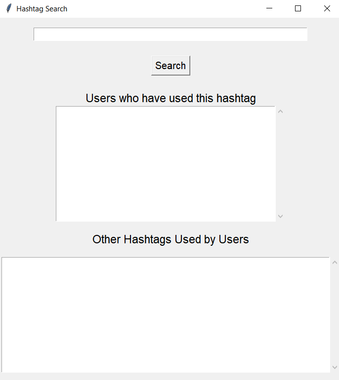
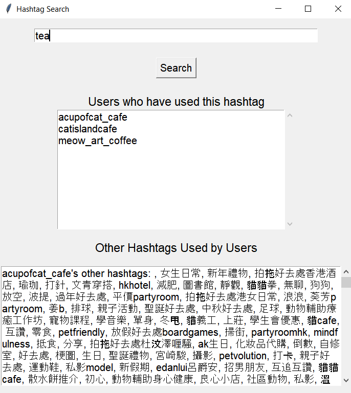
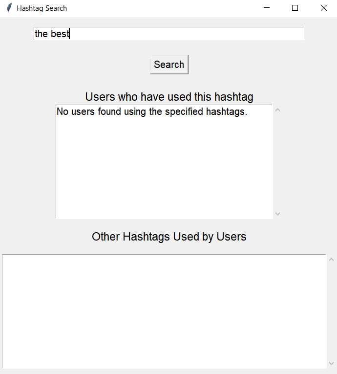

# Instagram Analytics Project

This project provides an analytical approach to understanding Instagram user engagement through various metrics. By collecting and analyzing Instagram profile data, it aims to identify key factors that significantly influence user engagement levels. As an example, data from 10 different cat cafés was selected to better understand market-specific interactions
 

# Features
The project evaluates numerous aspects of Instagram accounts including:

- **Number of Instagram posts** (Total_ig_posts)
- **Average word count per post** (average_post_word_count)
- **Account operation duration** (days_from_today)
- **Update frequency** (DateDiff(days))
- **Usage of common hashtags** (top10_commontags_using_%)
- **Promotional language usage** (content_PL_counts)
- **Mentions of café locations in the IG bio** (place_mentions_in_bio)
- **Mentions of café locations in the full name**(place_mentions_in_fullName)

# Key Insights
Through comprehensive analysis, it was found that the following factors have a substantial impact on followersCount and average_post_like:

- Total number of Instagram posts
- Average word count per post
- Days active on Instagram
- Usage percentage of top 10 common hashtags
- Café place mentions in Instagram bio and full name
- Data Collection

 

**Graphs Analyzing the Relationship between Instagram Metrics and User Engagement**

 

 

# Data was collected using:

- **PhantomBuster**: Captures basic Instagram profile data, including profile URLs, post dates, engagement metrics, business information, and more.
- **Instaloader**: Collects detailed data on individual Instagram posts, including post content and likes count.

# GUI
The GUI application built with Tkinter enables users to:

- Search for specific hashtags
- Display users who have utilized these hashtags
- Show other hashtags used by these users

**Hashtag Search Tool Main Screen**

 

**Hashtag Used Record Found Screen**

 

**No Users Found Using the Specified Hashtags Screen**

#
